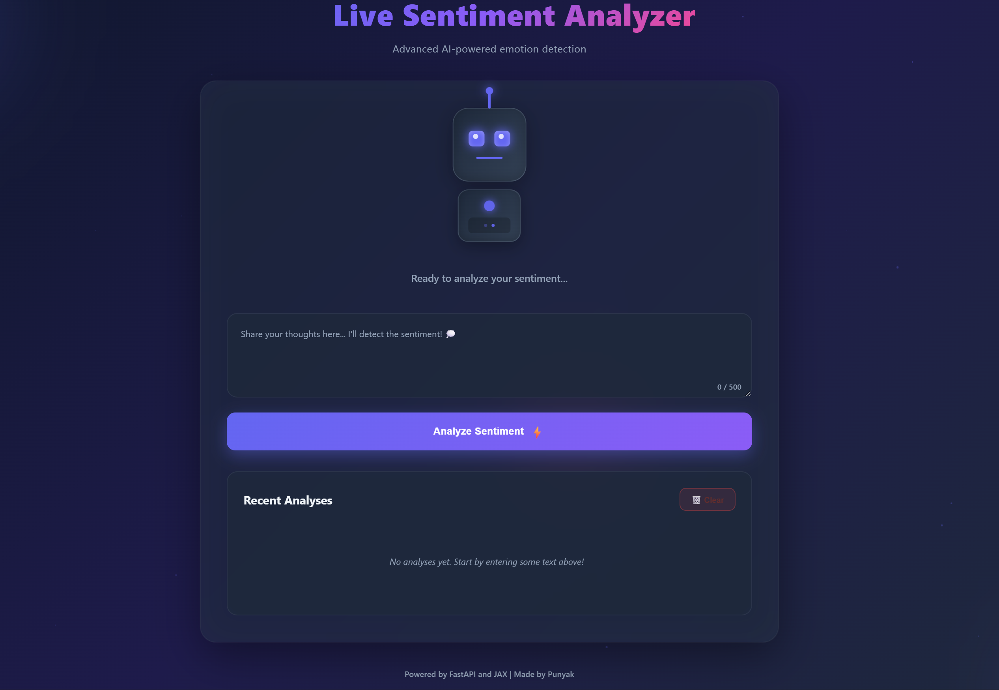
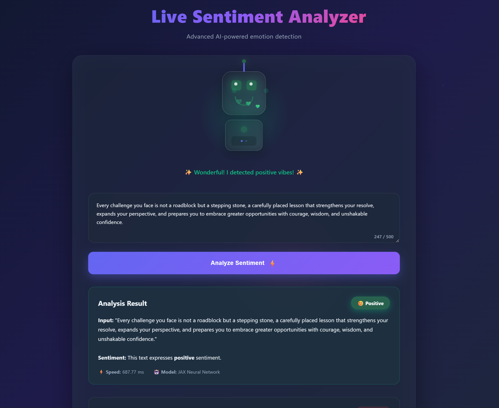
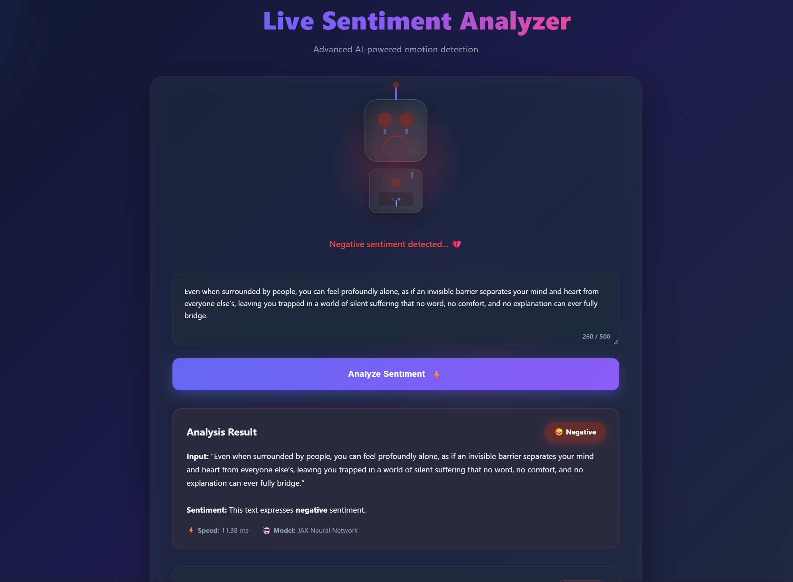
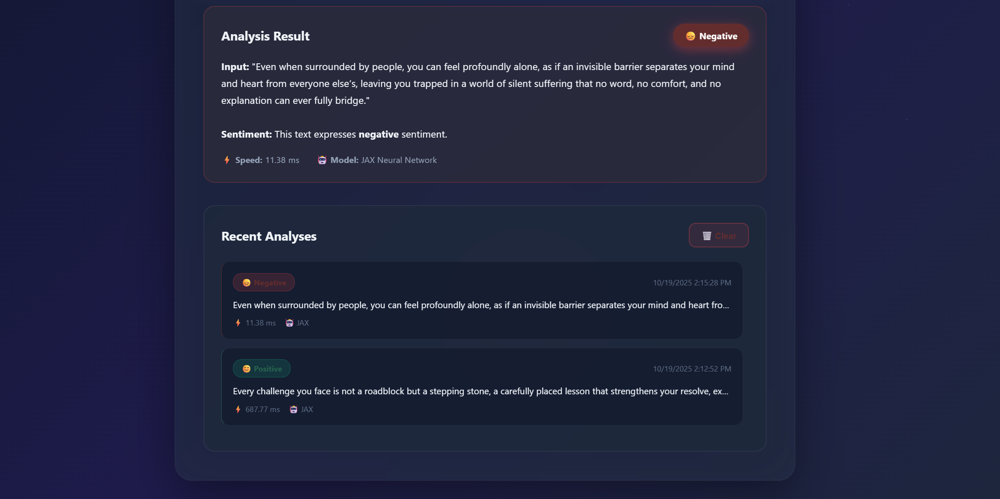

# Sentiment Classification with Scikit-learn and JAX frameworks

## Overview
This repository explores binary sentiment classification using two complementary approaches:

- **Scikit-learn baseline**: Logistic Regression with TF-IDF features.  
- **FLAX models**: Neural architectures starting from an embedding + pooling classifier, with plans to extend to LSTMs.

The aim is to combine fast prototyping with sklearn and flexible deep learning with JAX, while providing deployable inference endpoints via FastAPI.

---

## Dataset
- **Source**: [Juggernaut Sentiment Analysis by Adeoluwa Adeboye](https://www.kaggle.com/datasets/adeoluwa/juggernaut-sentiment-analysis).  
- **Note**: This dataset is not owned by me. All credit goes to the original creator.  

The dataset was split into multiple configurations (different vocab sizes, n-gram ranges, and train/test splits) for experimentation.

### Dataset Limitations
While the dataset provides a good foundation for binary sentiment classification, it has several limitations that affect model performance:

- **Sarcasm and Irony**: The dataset does not contain strong coverage of sarcastic or ironic expressions. Models trained on it may fail to capture sentiment in such cases (e.g., "Yeah, this was *really* helpful" used sarcastically).  
- **Contextual Nuance**: Sentiment labels are often assigned at the sentence level, without accounting for larger context (paragraphs, conversations). Models may misinterpret statements that depend on prior text.  
- **Domain Generalization**: The dataset is focused on general sentiment and may not transfer well to specific domains (e.g., product reviews vs. social media vs. news articles).  
- **Class Balance**: Depending on preprocessing choices, there may be class imbalance which can bias the model toward the majority label.  
- **Vocabulary Coverage**: Fixed vocabulary sizes (e.g., 80k in sklearn baseline) can lead to rare or emerging terms being ignored or mapped to `<UNK>`.

These limitations should be considered when evaluating model performance and deploying in real-world scenarios

---

## Current Progress
- Baseline sklearn model achieved ~82 F1 score with Logistic Regression + TF-IDF (1–5 grams, 80k vocabulary)
- JAX prototype (embedding + pooling) has caught up to sklearn baseline performance
- All JAX experiments were run on **CPU only**, since local JAX CUDA installation defaults to the latest CUDA version which is not supported by the RTX 4060 GPU locally available to me
- Ongoing experiments with hidden layer depth/width
- Next steps include LSTM models in Flax for improved sequence modeling

---

## Deployment
Both sklearn and JAX models can be deployed locally with FastAPI

- `sklearn-app.py`: Serves the Logistic Regression model
- `jax-app.py`: Serves the Flax neural network (embedding + pooling)
- All inference activity is logged to static `logs/inference.log` and dynamic `backend/inference.log`

### Run locally
```bash
pip install -r requirements.txt
```

Start either server:
```bash
uvicorn backend.sklearn-app:app --reload
uvicorn backend.jax-app:app --reload   # NOTE:- Currently supports a single pipelined model
```

#### Example request with CURL
```bash
curl -X POST "http://127.0.0.1:8000/predict" \
     -H "Content-Type: application/json" \
     -d '{"text": "I absolutely loved this movie!"}'
```

- ***Example response (sklearn)***
```json
{
  "input": "I absolutely loved this movie!",
  "prediction": 1,
  "inference_time_ms": 3.42
}
```

- ***Example response (jax)***
```json
{
  "input": "I absolutely loved this movie!",
  "prediction": 1,
  "inference_time_ms": 5.12,
  "Jax model": true
}
```

---

### Running on Frontend
> ***A sentient robot gives out the sentiment based on the user's sentence input.***



> ***A good sentiment***



> ***A bad sentiment***



> ***History saving and model info with inference time***



---

## References
- Adeoluwa Adeboye, Juggernaut Sentiment Analysis Dataset: [Kaggle](https://www.kaggle.com/datasets/adeoluwa/juggernaut-sentiment-analysis)
- Scikit-learn Documentation: [https://scikit-learn.org/stable/](https://scikit-learn.org/stable/)
- JAX | Flax | Optax Documentation: [https://jax.readthedocs.io/](https://jax.readthedocs.io/) | [https://flax.readthedocs.io/](https://flax.readthedocs.io/)

---